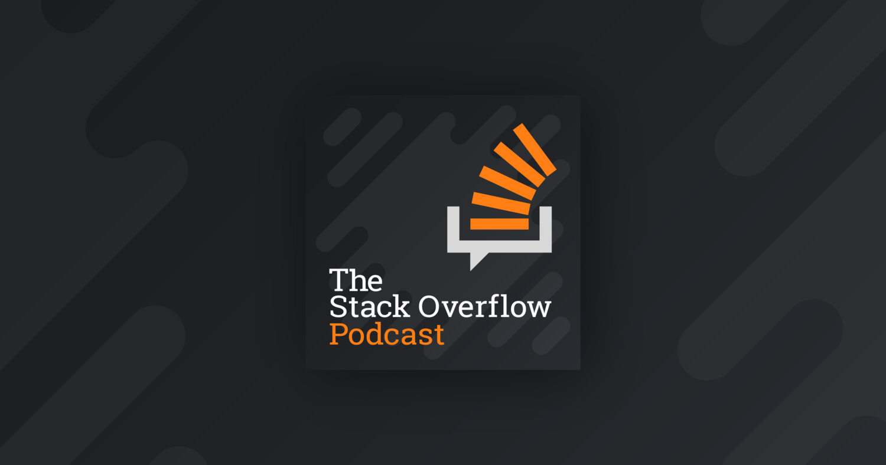

# StackOverflow Podcast



## About

Simple script that downloads [StackOverflow Podcast](https://stackoverflow.blog/podcast/)

## Dependencies
This is a `bash` script.

## Usage

To run weekly, add to your [crontab](https://en.wikipedia.org/wiki/Cron)

```
@weekly cd /path/to/script && /bin/bash get_podcasts.sh
```
